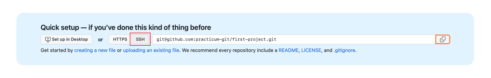

# Git — самая популярная система контроля версий.

## Устанавливаем и настраиваем Git
Windows. Скачайте [Git для Windows](https://git-scm.com/download/win), запустите exe-файл, следуйте инструкциям.

MacOS. Скачайте [Git для macOS](https://git-scm.com/download/mac) и запустите dmg-файл. Если он не запускается, зайдите в Системные настройки — Безопасность и нажмите кнопку Open anyway (Всё равно открыть).

## Как проверить, что Git установился
Откройте терминал и введите команду

`git --version`

Если Git установлен, то вы увидите номер версии, например, 2.41.0.

## Настраиваем Git
Теперь нужно ввести имя и адрес электронной почты, чтобы ваши действия в Git были подписаны, а ещё для привязки к GitHub.

Добавить имя (введите его внутри кавычек):

`git config --global user.name "ваше имя"`

Добавить электронную почту (замените email@example. com на вашу почту):

`git config --global user.email email@example.com`

Опция `--global` значит, что имя и почта будут использоваться для всех ваших действий в Git. Если вы хотите менять эту информацию для разных проектов, то вводите эти же команды, только без опции `--global`.

## Регистрируемся на GitHub

**GitHub** (или Гитхаб) — веб-сервис на основе Git, который помогает совместно разрабатывать IT-проекты. На Гитхабе разработчики публикуют свой и редактируют чужой код, комментируют проекты и следят за новостями других пользователей.

Профиль на Гитхабе и все проекты в нём — ваше публичное портфолио разработчика, поэтому нужно завести профиль, если у вас его ещё нет.

1. Зайдите на сайт [https://github.com](https://github.com) и нажмите кнопку Sign up.
2. Введите имя пользователя (понадобится в дальнейшей работе), адрес электронной почты (такой же, как при настройке Git) и пароль.
3. На почту придёт код активации — введите на сайте.

## Устанавливаем SSH-ключи
Чтобы получить доступ к проектам на GitHub со своего компьютера и выполнять команды без постоянного ввода пароля, нужно, чтобы сервер вас узнавал. Для этого используются SSH-ключи.

> SSH — протокол для безопасного соединения между компьютерами.

SSH-ключ состоит из двух частей — открытого и закрытого ключа. Открытый ключ мы отправляем на сервер. Его можно не прятать от всех и не переживать, что кто-то его украдёт, потому что без закрытого ключа он бесполезен. А вот закрытый ключ — секретная часть, доступ к нему должен быть только у вас. Это важно.

> [RSA протокол](https://ru.wikipedia.org/wiki/RSA)

Мы будем подключаться к GitHub по SSH. Это работает так:
1. Вы отправляете какую-то информацию на GitHub, который знает ваш открытый ключ.
2. GitHub по открытому ключу понимает, что вы это вы, и отправляет что-то в ответ.
3. Только вы можете расшифровать этот ответ, потому что только у вас есть подходящий закрытый ключ.

А чтобы подключиться к GitHub с помощью SSH-ключа, сначала нужно его создать.

## Проверяем SSH-ключи
Перед созданием нового SSH-ключа проверим, есть ли на компьютере другие ключи. Обычно они лежат в папке с названием .ssh — поэтому посмотрим, есть ли в ней что-то, с помощью команды в терминале:

`ls -al ~/.ssh`

Если у вас уже есть SSH-ключ, то в списке будут файлы с именами вроде id_rsa.pub, id_ecdsa.pub или id_ed25519.pub. А если терминал ругается, что директории ~/.ssh не существует, значит, у вас нет SSH-ключей. Давайте это исправим.

## Создаём новый SSH-ключ
Откройте терминал и скопируйте туда эту команду. Не забудьте подставить в кавычки почту, на которую вы регистрировались на Гитхабе.

`ssh-keygen -t ed25519 -C "your_email@example.com"`

**ed25519** — это алгоритм для генерации ключей. Если ваша система не поддерживает алгоритм ed25519 (и вы увидели ошибку), используйте немного другую команду с алгоритмом rsa:

`ssh-keygen -t rsa -b 4096 -C "your_email@example.com"`

Терминал спросит, куда сохранить ключ. Если не хотите менять имя файла, которое предлагает терминал, просто нажмите Enter.

> Generating public/private имя-ключа key pair.
> Enter a file in which to save the key (/c/Users/ваш-профиль/.ssh/id_имя-ключа):*[Press enter]*

Теперь нужно добавить пароль, которым будет зашифрован ваш ключ. Это стоит сделать, иначе в дальнейшем могут быть проблемы с настройкой, да и так просто безопаснее.

В результате создаётся новый SSH-ключ, привязанный к вашей электронной почте.

Создание ключа по шагам:

## Добавляем SSH-ключ в ssh-agent
**ssh-agent** — программа для хранения и управления SSH-ключами. Давайте запустим её и добавим туда наш SSH-ключ. Запускаем командой *eval "$(ssh-agent -s)"*:

`eval "$(ssh-agent -s)"`

Если в ответ терминал покажет надпись **«Agent pid»** и число — значит, всё ок, агент запущен.

Теперь добавим наш ключ командой.

`ssh-add ~/.ssh/id_ed25519`

Если у вашего ключа другое имя, замените название id_ed25519 именем файла с ключом (это правило применяется и дальше в инструкции). Если вы устанавливали пароль на ключ, введите его два раза после ввода команды **ssh-add** (терминал подскажет, когда это сделать).

Теперь, если всё хорошо, появится надпись *Identity added* — значит, можно переходить к добавлению ключа на GitHub.

## Копируем SSH-ключ
Чтобы добавить ключ на GitHub, нужно сначала его скопировать из вашего файла командой *clip*. Вы не увидите ключ на экране, но он появится в буфере обмена, и его можно будет вставить на Гитхаб.

`clip < ~/.ssh/id_ed25519.pub`

Команда *clip* может не сработать на вашем компьютере, тогда есть два способа узнать ключ — простой и сложный.

**Сложный способ.** Найдите скрытую папку **.ssh**, откройте файл **id_ed25519.pub** в текстовом редакторе и скопируйте его содержимое.

**Простой способ.** Введите команду ниже и ключ появится прямо в терминале — его нужно вручную скопировать в буфер обмена. Ключ начинается с ssh-ed22519 или ssh-rsa (или похожей строки) — поэтому копируйте строку прямо с самого начала.

`~ cat ~/.ssh/id_ed25519.pub`

## Добавляем SSH-ключ на GitHub
Это нужно сделать, чтобы GitHub вас узнавал.

Перейдите на [страницу для работы с ключами](https://github.com/settings/keys) в вашем профиле на GitHub и нажмите кнопку *New SSH key*.

В поле *Title* нужно добавить название нового ключа. Например, если вы используете Mac, вы можете назвать ключ *MacBook Air*. А ключ, который вы скопировали на прошлом шаге, вставьте в поле *Key*.

Теперь нажмите кнопку *Add SSH key* и, если потребуется, введите свой пароль от GitHub, чтобы подтвердить сохранение. Если всё сделано верно, новый ключ появится в списке на странице [https://github.com/settings/keys](https://github.com/settings/keys).

Теперь мы можем поработать с проектом в репозитории.

## Что такое репозиторий

**Репозиторий** — папка с файлами вашего проекта на сервере GitHub. Так вы можете работать с проектом откуда угодно, не переживая, что какие-то файлы потеряются — все данные останутся в репозитории.

Если над проектом работает несколько программистов, сначала создаётся мастер-репозиторий — это общий репозиторий с рабочей версией проекта. А каждый программист работает с форком — то есть полной копией мастер-репозитория. В форке вы можете безнаказанно менять код и не бояться что-то сломать в основной версии проекта.

## Привязать удалённый репозиторий к локальному

`git remote add`

Перейдите на страницу удалённого репозитория, выберите тип **SSH** и скопируйте **URL**. Кнопка справа позволит сделать это мгновенно.

Откройте консоль, перейдите в каталог локального репозитория и введите команду `git remote add` (от англ. *remote* — «удалённый» и *add* — «добавить»).

`$ cd ~/dev/first-project`
`$ git remote add origin git@github.com:%ИМЯ_АККАУНТА%/first-project.git`

Команде необходимо передать два параметра: имя удалённого репозитория и его URL. В качестве имени используйте слово `origin`. А URL вы скопировали со страницы удалённого репозитория.

`origin` (англ. «источник») — стандартный псевдоним, с помощью которого можно обращаться к главному удалённому репозиторию (обычно такой репозиторий один). Это значительно упрощает работу.

## Убедиться, что репозитории связаны

`git remote -v`

Отлично: вы связали локальный репозиторий с удалённым. Осталось убедиться, что всё работает, с помощью следующей команды.

`origin    git@github.com:%ИМЯ_АККАУНТА%/%ИМЯ-ПРОЕКТА%.git (fetch)`
`origin    git@github.com:%ИМЯ_АККАУНТА%/%ИМЯ-ПРОЕКТА%.git (push)`

В выводе вы должны увидеть две строчки, аналогичные тем, что показаны выше.

Флаг `-v` — короткая форма флага `--verbose` (англ. «подробный»). Он позволяет показать больше информации в выводе.

## Синхронизируем локальный и удалённый репозитории

Вы зарегистрировались на GitHub, сгенерировали SSH-ключ и привязали локальный репозиторий к удалённому. Самое сложное позади! Теперь разберём, как выкладывать свои правки на удалённый репозиторий. Но сначала немного о ветках.

## Основная ветка

Мы упоминали, что каждый коммит сохраняет актуальное состояние файлов. Сами же коммиты хранятся в ветках (англ. branch).
Если коммит — это снимок состояния файлов, то ветка — временна́я шкала, на которой расположены эти снимки. Ветка всегда начинается от одного из коммитов.
В репозитории может существовать сразу несколько веток — параллельных историй изменений. Также они могут соединяться друг с другом.

Самая первая ветка в репозитории появляется автоматически и называется `main` (англ. «основная») или `master`. Её имя нужно указывать при отправке коммитов на удалённый репозиторий или при получении их из него.

## Отправить изменения на удалённый репозиторий

`git push` (от англ. push — «толкать»).

В первый раз эту команду нужно вызвать с флагом `-u` и параметрами `origin` (имя удалённого репозитория) и `main` или `master` (название текущей ветки). **Флаг `-u` свяжет локальную ветку с одноимённой удалённой.** Как вы связывали локальный и удалённый репозитории, так же и здесь нужно дополнительно связать ветки.

`git push -u origin main`

## Клонируем проект на компьютер

Открываем терминал и переходим в папку с будущим проектом.

Когда перейдёте в папку, введите команду `git clone` для клонирования репозитория:

`git clone git@github.com:your-nickname/your-project.git`

Замените *your-nickname* на ваше имя пользователя на GitHub, а *your-project* — на название проекта. Проще всего их найти прямо наверху страницы репозитория.

Кстати, если вы хотите, чтобы название папки с проектом у вас на компьютере отличалось от имени репозитория, можете дополнить команду клонирования, добавив в конце другое название:

`git clone git@github.com:_your-nickname_/_your-project_.git folder_name`

## Создаём новую ветку

Откройте терминал и введите команду

`git branch`

Она показывает список веток, с которыми мы работаем в проекте, и выделяет текущую. Если мы находимся в main , то создаём новую ветку командой

`git checkout -b имя-новой-ветки`

`➜  1173761-device-34 git:(main) git checkout -b task1`
Переключено на новую ветку «task1»
`➜  1173761-device-34 git:(task1)`

Если текущая ветка не *main*, переключитесь на неё с помощью команды `checkout`. После `git checkout` надо указать название нужной ветки.

`git checkout main`

Мы делаем это, чтобы новая ветка содержала свежую рабочую версию проекта. Если вы ошиблись в названии, например, допустили опечатку, вы можете изменить название ветки с помощью команды:

`git branch -m старое-имя-ветки новое-имя-ветки`

## Сохраняем изменения

После того, как вы создали ветку и поработали в ней у себя на компьютере, нужно сохранить результат, чтобы появился в репозитории и не пропал.

Если вы хотите сохранить изменения не во всех файлах, для начала введите команду `git status`. Она покажет текущее состояние в вашей ветке, а именно список с названиями изменённых файлов, если они есть, и укажет на те, которые ожидают записи и сохранения (обычно они выделены красным цветом).

Чтобы сохранить все изменения разом, используйте команду

`git add -A`

Чтобы сохранить изменения только отдельных файлов, укажите их имена вручную. Например, если вы изменили файл **index.html**, введите

`git add index.html`

Если название очень длинное, вы начните его писать, нажмите *Tab* и терминал сам предложит продолжение пути к файлу.

## Делаем коммит

Сделать коммит — значит зафиксировать все сохранённые изменения и дать им название.

`git commit -m "ваше сообщение"`

Текст сообщения должен быть лаконичным и вместе с этим сообщать о том, что делает коммит (внесённые изменения). Например,
- Добавляет имя наставника в Readme
- Вводит функцию сортировки изображений
- Правит ошибку в поиске городов на карте

## Создаём новую ветку

Она показывает список веток, с которыми мы работаем в проекте, и выделяет текущую.

`git branch`

Создай новую ветку.

`git branch имя-новой-ветки`

Создай новую ветку и сразу переключись на неё.

`git checkout -b имя-новой-ветки`

Если вы ошиблись в названии, например, допустили опечатку, вы можете изменить название ветки с помощью команды:

`git branch -m старое-имя-ветки новое-имя-ветки`

Переключись на ветку

`git checkout имя-ветки`

Удаление веток

`git branch -d имя-ветки` — удали ветку, но только если она является частью main;

`git branch -D имя-ветки` — удали ветку, даже если она не объединена с main.